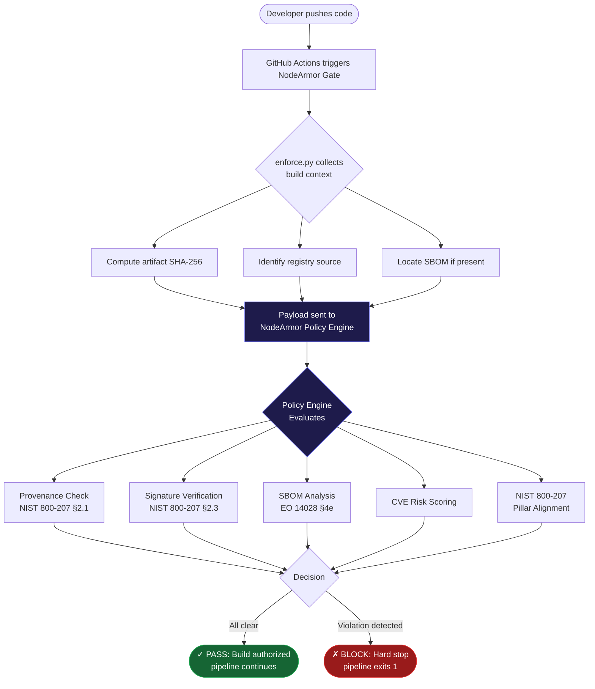
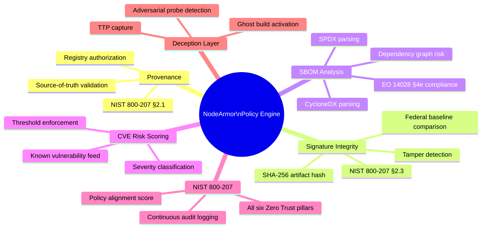
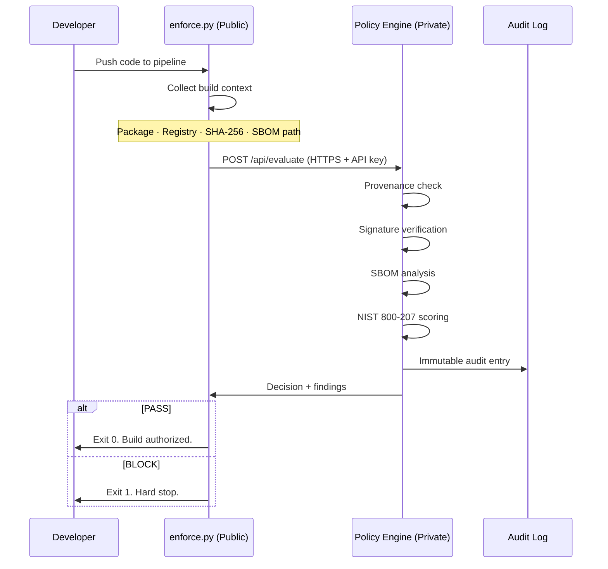

<div align="center">


<br/>

[](https://csrc.nist.gov/publications/detail/sp/800-207/final)
[](https://www.whitehouse.gov/briefing-room/presidential-actions/2021/05/12/executive-order-on-improving-the-nations-cybersecurity/)
[]()
[]()
[]()
[]()

<br/>

[]()
[]()
[]()
[-0ea5e9?style=flat-square)]()
[]()

<br/>

<h2>A Zero Trust enforcement gate for federal software supply chains.<br/>Open client. Private policy engine. Binary outcome: <code>PASS</code> or <code>BLOCK</code>.</h2>

<br/>

</div>

---

> **NodeArmor is not a scanner. It is not a report generator. It is an enforcement gate.**
> Every artifact must prove provenance, integrity, and authorization before it reaches production. One failure locks the pipeline. No overrides. No exceptions. No manual bypass.

---

## Contents

| Section | What You Will Find |
|---------|-------------------|
| [What Makes It Different](#what-makes-nodearmor-different) | Why this is not another scanner |
| [How It Works](#how-it-works) | The full enforcement flow |
| [Architecture](#architecture) | Open client + private engine trust model |
| [Quick Start](#quick-start) | Running in under 5 minutes |
| [GitHub Actions Integration](#github-actions-integration) | Drop-in CI/CD workflow |
| [Configuration](#configuration) | Every config option explained |
| [What Gets Checked](#what-gets-checked) | All enforcement checks |
| [NIST 800-207 Alignment](#nist-sp-800-207-alignment) | Zero Trust pillar mapping |
| [Sector Use Cases](#sector-use-cases) | Federal, defense, healthcare, finance |
| [Trust Model](#trust-model-open-client--private-engine) | Why the engine is private |
| [Performance](#performance) | Speed comparison vs. legacy process |
| [FAQ](#faq) | Common questions answered |

---

## What Makes NodeArmor Different

> In 2020, attackers compromised SolarWinds' build pipeline. Malicious code was cryptographically signed, trusted by every security tool on the market, and shipped to 18,000 organizations, including the Pentagon. Nobody caught it for 266 days.
>
> Not because people weren't watching. Because **the pipeline itself was the weapon.**

Most security tools are passive observers. They scan. They generate reports. They wait for a human to act. Under pressure, during a live deployment, at 2am. Humans make mistakes.

NodeArmor removes the human from that decision entirely.

| | Legacy Security Tools | NodeArmor |
|---|:---:|:---:|
| **Approach** | Scan and report | Enforce and decide |
| **Requires Human Review** | Yes, always | No, gate decides |
| **Detection Time** | 24–72 hours | Under 30 seconds |
| **Response to Threat** | Alert sent | Pipeline locked |
| **SBOM Enforcement** | Manual | Automated, per EO 14028 |
| **Provenance Verification** | Optional | Mandatory on every build |
| **Sophisticated Threat Response** | Alert, hope | Gate + active deception layer |
| **NIST 800-207 Alignment** | Partial | All six pillars |
| **Dependencies Required** | Dozens | Zero (Python stdlib only) |
| **Cost** | Enterprise license | Free |

---

## How It Works



---

## Architecture

```mermaid
graph LR
    subgraph PUBLIC["🔓 Public: This Repository"]
        direction TB
        EP["enforce.py\nThin client shell\nFully auditable"]
        AP["auth.py\nAPI key management"]
        CF[".nodearmor/config.yaml\nPolicy configuration"]
        GH[".github/workflows/\nCI/CD integration"]
    end

    subgraph ENGINE["🔒 Private: Policy Engine (Managed Service)"]
        direction TB
        PE["Policy Engine\nNIST 800-207 evaluation"]
        SA["SBOM Analyzer\nCycloneDX + SPDX"]
        SV["Signature Verifier\nFederal baseline registry"]
        DL["Deception Layer\nGhost build / honeypot"]
    end

    PUBLIC -->|"HTTPS + X-NodeArmor-Key\nPackage · Registry · SHA-256 · SBOM"| ENGINE
    ENGINE -->|"PASS / BLOCK\nFindings · Risk score"| PUBLIC

    style PUBLIC fill:#0f172a,color:#94a3b8,stroke:#334155
    style ENGINE fill:#1e1b4b,color:#a5b4fc,stroke:#6366f1
```



**Why this split?**

- **The client (this repo)** is fully auditable. Anyone can read every line of `enforce.py` and verify exactly what data is collected and sent. There is no hidden behavior.
- **The engine (private)** contains the policy logic, threat intelligence, and deception layer. It cannot be reverse-engineered by adversaries because it never runs on their infrastructure.
- This is the same model used by Semgrep, Snyk, and HashiCorp Sentinel, trusted by the federal community.

---

## Quick Start

### Prerequisites

- Python 3.10 or higher
- A NodeArmor API key (`NODEARMOR_API_KEY`)
- No other dependencies: pure Python stdlib

### 1. Clone the repo

```bash
git clone https://github.com/saisravan909/nodearmor.git
cd nodearmor
```

### 2. Set your API key

```bash
# Recommended: environment variable (never commit API keys)
export NODEARMOR_API_KEY=na_your_key_here

# Or save to config (add to .gitignore)
python3 auth.py set na_your_key_here
```

### 3. Run the gate

```bash
python3 enforce.py \
  --package lodash@4.17.21 \
  --registry https://registry.npmjs.org
```

**Expected output (PASS):**

```
  ╔══════════════════════════════════════════════════════╗
  ║        N O D E A R M O R  ·  GATE  v1.0            ║
  ║   NIST SP 800-207  ·  EO 14028  ·  Zero Trust      ║
  ╚══════════════════════════════════════════════════════╝

  Package  : lodash@4.17.21
  Registry : https://registry.npmjs.org
  Time     : 2026-04-04T14:22:31+00:00

  Submitting to NodeArmor Policy Engine ...

    [✓] Provenance verified: authorized registry confirmed
    [✓] Signature matches federal baseline
    [✓] SBOM analyzed: 1 component, no threats detected
    [✓] NIST 800-207 alignment verified

  ╔══════════════════════════════════════════════════════╗
  ║  ✓  GATE PASSED: Build authorized to proceed        ║
  ╚══════════════════════════════════════════════════════╝
```

**Expected output (BLOCK):**

```
  ╔══════════════════════════════════════════════════════╗
  ║        N O D E A R M O R  ·  GATE  v1.0            ║
  ║   NIST SP 800-207  ·  EO 14028  ·  Zero Trust      ║
  ╚══════════════════════════════════════════════════════╝

  Package  : compromised-pkg@3.3.6
  Registry : https://malicious-registry.example.com
  Time     : 2026-04-04T14:22:31+00:00

  Submitting to NodeArmor Policy Engine ...

    [✗] Unauthorized registry detected
         'malicious-registry.example.com' is not in the federal approved list
    [✗] Signature mismatch: artifact may be tampered
         SHA-256 does not match federal baseline. Possible supply chain compromise.
    [✗] SBOM absent: dependency provenance unknown

  ╔══════════════════════════════════════════════════════╗
  ║  ✗  GATE BLOCKED: Hard stop. Build rejected.        ║
  ╚══════════════════════════════════════════════════════╝
```

### 4. Run with artifact integrity check

```bash
python3 enforce.py \
  --package myapp@2.1.0 \
  --registry https://pypi.org \
  --artifact dist/myapp-2.1.0.tar.gz
```

---

## GitHub Actions Integration

Add NodeArmor to any GitHub Actions workflow in under 60 seconds:

```yaml
# .github/workflows/nodearmor-gate.yml
name: NodeArmor Supply Chain Gate

on:
  push:
    branches: [main]
  pull_request:
    branches: [main]

jobs:
  nodearmor-gate:
    name: Zero Trust Enforcement Gate
    runs-on: ubuntu-latest
    permissions:
      pull-requests: write
      contents: read

    steps:
      - name: Checkout
        uses: actions/checkout@v4

      - name: Set up Python
        uses: actions/setup-python@v5
        with:
          python-version: "3.12"

      - name: Run NodeArmor Gate
        env:
          NODEARMOR_API_KEY: ${{ secrets.NODEARMOR_API_KEY }}
        run: |
          python3 enforce.py \
            --package "${{ github.repository }}@${{ github.sha }}" \
            --registry "https://github.com/${{ github.repository }}"

      - name: BLOCK. Hard Stop.
        if: failure()
        run: |
          echo "::error title=NodeArmor Gate Blocked::Supply chain violation detected."
          exit 1
```

Add your API key to **Settings → Secrets → Actions** as `NODEARMOR_API_KEY`.

---

## Configuration

```yaml
# .nodearmor/config.yaml

# API key (prefer NODEARMOR_API_KEY env var over storing here)
# api_key: "na_your_key_here"

# Policy Engine endpoint
api_url: "https://node-armor-enforcement.replit.app/api/evaluate"

# Severity threshold: block on this level and above
# Options: LOW | MEDIUM | HIGH | CRITICAL
severity_threshold: "HIGH"

# Authorized package registries: provenance source of truth
authorized_registries:
  - "registry.npmjs.org"
  - "pypi.org"
  - "files.pythonhosted.org"
  - "registry.federal.gov"
  - "ghcr.io"

# SBOM format expected from your build toolchain
# Options: cyclonedx | spdx | auto
sbom_format: "auto"

# Webhook to notify on BLOCK (Slack, Teams, PagerDuty, etc.)
notify_webhook: ""
```

### Environment Variables

| Variable | Required | Description |
|----------|----------|-------------|
| `NODEARMOR_API_KEY` | **Yes** | Your NodeArmor API key (`na_...`) |
| `NODEARMOR_API_URL` | No | Override the Policy Engine endpoint |

---

## What Gets Checked



---

## NIST SP 800-207 Alignment

Every enforcement decision is mapped to the Zero Trust Architecture standard:

| Pillar | NIST Control | NodeArmor Check |
|--------|-------------|-----------------|
| **Identity** | §2.1: Resource Authorization | Registry provenance verification |
| **Device** | §2.2: Device Integrity | Build environment posture |
| **Network** | §2.3: Data-in-Transit Integrity | Artifact signature validation |
| **Application Workload** | §2.4: Least-Privilege Access | Dependency scope enforcement |
| **Data** | §2.5: Data Classification | SBOM completeness and accuracy |
| **Visibility** | §2.6: Continuous Monitoring | Immutable audit log on every evaluation |

Additionally compliant with:
- **EO 14028** §4(e): SBOM requirement for all federal software
- **SSDF (SP 800-218)**: Secure Software Development Framework
- **CMMC 2.0**: Level 2 and Level 3 supply chain controls

---

## Sector Use Cases

<details>
<summary><strong>01: Federal Agencies: Software Supply Chain Security</strong></summary>

Federal agencies face FISMA, FedRAMP, and EO 14028 requirements simultaneously. NodeArmor enforces SBOM collection, signature verification, and authorized registry checks on every build, automatically satisfying the supply chain security requirements without additional tooling or procurement.

[Full write-up →](use-cases/01-federal-agency-supply-chain/)

</details>

<details>
<summary><strong>02: Defense Contractors: CMMC Alignment</strong></summary>

CMMC 2.0 Level 2 and 3 require documented supply chain risk management. NodeArmor provides immutable audit trails for every build decision, satisfying AC.2.007, CM.2.061, and SI.1.210 controls.

[Full write-up →](use-cases/02-defense-contractors/)

</details>

<details>
<summary><strong>03: Critical Infrastructure: ICS/OT Protection</strong></summary>

Industrial control systems require deterministic, low-latency security decisions. NodeArmor's binary PASS/BLOCK outcome integrates with OT pipelines without adding human-in-the-loop latency.

[Full write-up →](use-cases/03-critical-infrastructure/)

</details>

<details>
<summary><strong>04: Red Team / Purple Team: Adversarial Testing</strong></summary>

NodeArmor's deception layer actively captures TTPs from red team exercises, generating real threat intelligence rather than simply blocking the attack.

[Full write-up →](use-cases/04-red-team-purple-team/)

</details>

<details>
<summary><strong>05: Government Software Vendors: FedRAMP</strong></summary>

ISVs selling to federal agencies need to demonstrate supply chain security as part of FedRAMP authorization. NodeArmor's audit logs and NIST 800-207 alignment directly support the authorization package.

[Full write-up →](use-cases/05-government-software-vendors/)

</details>

<details>
<summary><strong>06: Enterprise CI/CD: DevSecOps Integration</strong></summary>

NodeArmor drops into any GitHub Actions, GitLab CI, Jenkins, or CircleCI pipeline without reconfiguring the existing workflow. One file, one secret, enforced on every run.

[Full write-up →](use-cases/06-enterprise-cicd/)

</details>

<details>
<summary><strong>07: Healthcare: HIPAA Supply Chain Compliance</strong></summary>

Healthcare organizations face OCR guidance requiring software supply chain security for systems processing PHI. NodeArmor's SBOM enforcement and dependency risk scoring directly addresses HIPAA §164.308(a)(1) Security Management requirements.

[Full write-up →](use-cases/07-healthcare/)

</details>

<details>
<summary><strong>08: Financial Services: SOC 2 + PCI DSS</strong></summary>

Financial institutions under PCI DSS 4.0 and SOC 2 Type II audits require documented change management and software integrity controls. NodeArmor's immutable audit trail satisfies both.

[Full write-up →](use-cases/08-financial-services-banking/)

</details>

---

## Trust Model: Open Client + Private Engine



**What gets sent to the Policy Engine:**

```json
{
  "package":        "myapp@2.1.0",
  "registry":       "https://registry.npmjs.org",
  "sha256":         "a3f5d...",
  "client_version": "1.0.0",
  "timestamp":      "2026-04-04T14:22:31Z"
}
```

Nothing else. No source code. No secrets. No repository contents. You can verify this by reading `enforce.py`. The entire payload construction is visible on lines 101–109.

---

## Performance

| Metric | Manual Security Review | Traditional Scanner | NodeArmor |
|--------|:---------------------:|:------------------:|:---------:|
| **Decision latency** | 24–72 hours | 5–30 minutes | **< 30 seconds** |
| **Human required** | Yes | Yes (review) | **No** |
| **SBOM check** | Manual | Separate tool | **Integrated** |
| **Audit trail** | Manual log | Varies | **Immutable, automatic** |
| **False positive override** | Common | Common | **Not possible by design** |
| **Sophisticated threat response** | Alert only | Block only | **Block + capture TTPs** |

---

## FAQ

<details>
<summary><strong>Why is the policy engine private?</strong></summary>

The same reason Snyk's vulnerability database and Semgrep's rule engine are not open source. If the enforcement logic is public, sophisticated adversaries can test their payload against it offline until it passes. The client (this repo) is fully auditable. You can verify every byte sent to the API. The engine that processes it runs in an environment you cannot access, which is the point.

</details>

<details>
<summary><strong>Can I run NodeArmor on-premises?</strong></summary>

Private cloud deployments are available for organizations that cannot send data to an external API. Override the endpoint in `config.yaml` with your internal Policy Engine URL. Contact nodearmor@saisravancherukuri.com.

</details>

<details>
<summary><strong>What data is sent to the API?</strong></summary>

Package name, registry URL, artifact SHA-256 hash (if provided), and timestamp. No source code, no secrets, no repository contents. See `enforce.py` lines 101–109 for the exact payload construction.

</details>

<details>
<summary><strong>Does this work with npm, pip, Maven, Go modules?</strong></summary>

Yes. NodeArmor is language-agnostic. Any package with a name, version, and registry URL can be evaluated. SBOM support covers CycloneDX and SPDX formats generated by any toolchain (Syft, cdxgen, etc.).

</details>

<details>
<summary><strong>What happens if the Policy Engine is unreachable?</strong></summary>

By design, NodeArmor **fails closed**: if the engine cannot be reached within 15 seconds, the gate returns `BLOCK`. A failed connection does not result in an unverified build proceeding. This is a Zero Trust requirement: never assume authorization; always verify.

</details>

<details>
<summary><strong>Is there a license requirement for production use?</strong></summary>

NodeArmor is licensed under BSL 1.1. It is free for evaluation and non-production use. Production deployments require a commercial license, which converts to Apache 2.0 on 2028-01-01. Contact nodearmor@saisravancherukuri.com.

</details>

---

## Repository Structure

```
nodearmor/
├── enforce.py                    # Enforcement gate client: the entry point
├── auth.py                       # API key management utility
├── .nodearmor/
│   └── config.yaml               # Policy configuration schema
├── .github/
│   └── workflows/
│       └── nodearmor-gate.yml    # Drop-in GitHub Actions workflow
├── use-cases/
│   ├── 01-federal-agency-supply-chain/
│   ├── 02-defense-contractors/
│   ├── 03-critical-infrastructure/
│   ├── 04-red-team-purple-team/
│   ├── 05-government-software-vendors/
│   ├── 06-enterprise-cicd/
│   ├── 07-healthcare/
│   └── 08-financial-services-banking/
├── LICENSE.md                    # Business Source License 1.1
├── SECURITY.md                   # Vulnerability reporting policy
└── CONTRIBUTING.md               # Contribution guidelines
```

---

## Security

Found a vulnerability in the client? See [SECURITY.md](SECURITY.md).

NodeArmor follows responsible disclosure. We respond within 72 hours and coordinate disclosure before public announcement.

---

<div align="center">

---

### Built to be shared, not sold.

*There is nothing to buy to get started. No license to negotiate. No vendor to call.*
*The problem is real, and the solution should be available to anyone who needs it.*

<br/>

**Sai Sravan Cherukuri** · Tool Architect
*"The Bridge Between Knowing and Doing."*

<br/>

[](https://csrc.nist.gov/publications/detail/sp/800-207/final)
[]()
[]()
[]()
[]()

</div>
